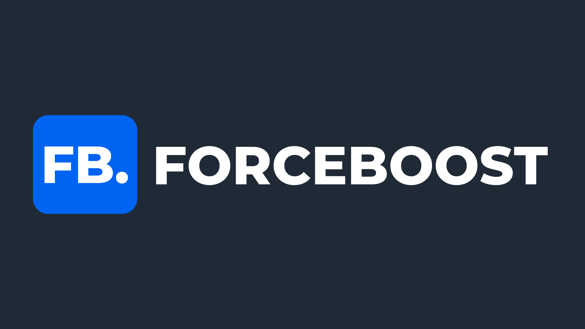
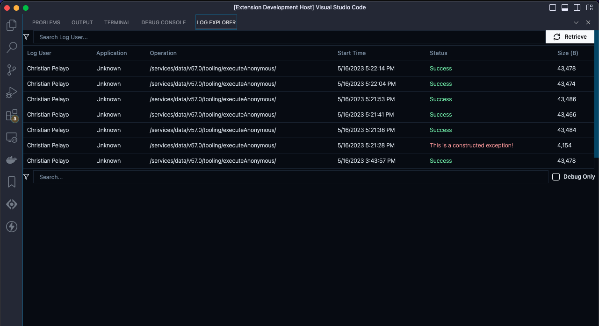
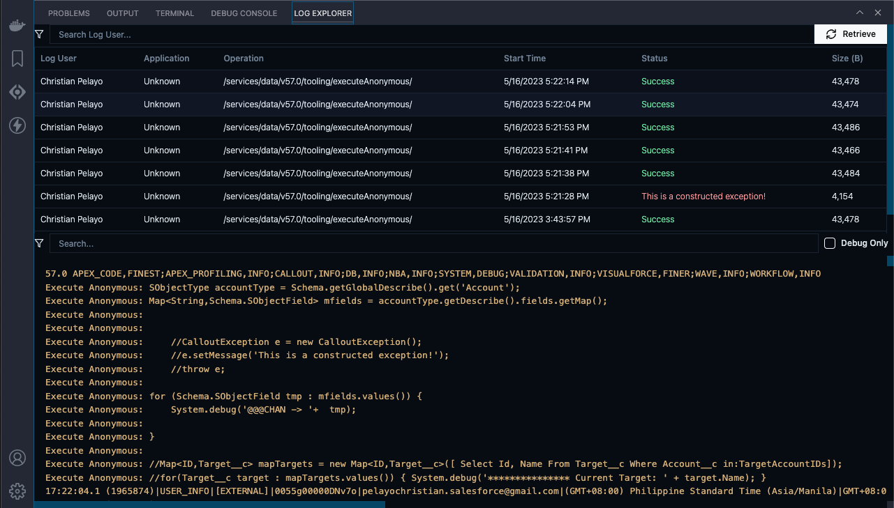

# ForceBoost

## 100% free and open-source to Power up Your Salesforce Development Experience

## Overview

ForceBoost is a Visual Studio Code extension designed to enhance the Salesforce developer experience, making it more efficient and productive. This extension provides various features to simplify the debugging process and streamline the retrieval of debug logs, allowing developers to focus on their code and troubleshoot with ease.

## Download ForceBoost from the Visual Studio Code Marketplace

You can easily download the ForceBoost extension from the Visual Studio Code Marketplace and start enhancing your Salesforce development experience. Here's how:

1. Launch Visual Studio Code.
2. Go to the Extensions view by clicking on the square icon on the left sidebar or pressing `Ctrl+Shift+X`.
3. In the search bar, type "ForceBoost" and press Enter.
4. Look for the ForceBoost extension in the search results.
5. Click on the "Install" button next to the ForceBoost extension to begin the installation process.
6. Once installed, you can start enjoying the powerful features and functionalities that ForceBoost offers.

Downloading ForceBoost from the Visual Studio Code Marketplace is quick and straightforward, allowing you to supercharge your Salesforce development in no time. Happy coding with ForceBoost!

## Features

### Log Explorer

The Log Explorer feature allows you to retrieve and explore debug logs directly within Visual Studio Code. It eliminates the need to switch to external tools or the Salesforce web interface for log analysis. With Log Explorer, you can:

-   Search String Filtering: Utilize the search string filtering feature to narrow down the debug logs based on specific keywords or phrases. This allows you to quickly locate logs related to a particular issue or scenario, making troubleshooting more targeted and efficient.

-   Debug Only: Enable the "Debug Only" option to filter the debug logs specifically for the user's custom debug logs. This feature ensures that you view and analyze only the debug logs generated by your activities, providing a focused and streamlined debugging experience.

## Future Feature

### Anonymous Editor with Debug Log Filtering

Actively working on introducing an in-house Anonymous Editor with built-in debug log filtering capabilities. This feature will enable you to write and execute anonymous Apex code snippets within Visual Studio Code, enhancing your development workflow. You'll be able to analyze the debug logs of your anonymous Apex execution directly from the editor, allowing for quick identification of issues and effective debugging.

Stay tuned for updates as currently continue to develop and enhance ForceBoost with more exciting features!

## Feedback and Support

Appreciate your interest in ForceBoost! If you have any feedback, suggestions, or issues to report, please visit the [GitHub repository](https://github.com/pelayochristian/force-boostx)
and create a new issue. I will be happy to assist you and continuously improve the extension based on your valuable feedback. Your input plays a crucial role in shaping the future of ForceBoost. Thank you for your support!

## License

ForceBoost is licensed under the [MIT License](LICENSE). Please review the license terms before using this extension.
